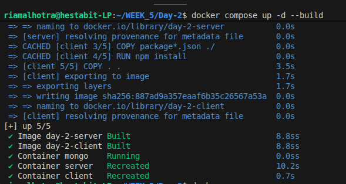
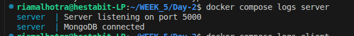
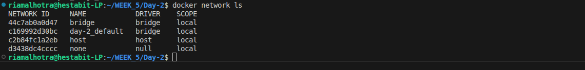
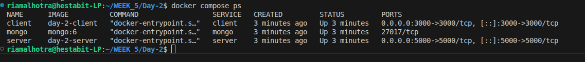
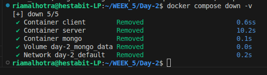

# Service Architecture — Day 2

## Objective

Deploy a **multi-container application** using **Docker Compose** consisting of:

* React Client
* Node.js Server
* MongoDB Database

All services should start using a **single command**:

```bash
docker compose up -d
```


---

## Project Structure

```
WEEK_5/
└── Day-2/
    ├── client/
    │   ├── Dockerfile
    │   ├── package.json
    │   └── src/
    ├── server/
    │   ├── Dockerfile
    │   ├── package.json
    │   └── src/
    ├── docker-compose.yml
    └── service-architecture.md
```

---

## Services Description

### 1. Client Service (React)

* Built using **Create React App**
* Runs in its own Docker container
* Uses Node.js image internally
* Exposed on **port 3000**

Access URL:

```
http://localhost:3000
```

---

### 2. Server Service (Node.js)

* Backend API built with Node.js
* Runs in a separate container
* Exposed on **port 5000**
* Connects to MongoDB using Docker internal networking

Server startup logs:



---

### 3. Database Service (MongoDB)

* Uses official `mongo:6` Docker image
* Runs as an isolated service
* Internal port: **27017**
* Uses Docker **named volume** for persistence

Volume used:

```
mongo_data
```


---

## Docker Compose Networking

* Docker Compose creates a default **bridge network**
* All services are connected automatically
* Containers communicate using **service names**

Example:

```
Server → mongodb://mongo:27017
```




## Architecture Flow

```
User Browser
     ↓
React Client (3000)
     ↓
Node Server (5000)
     ↓
MongoDB (27017)
```

---

## Logs & Debugging

Commands used to verify services:

```bash
docker compose ps
docker compose logs client
docker compose logs server
docker compose logs mongo
```




---

## Data Persistence

* MongoDB data is stored using a Docker named volume
* Data remains intact even after containers are stopped

Stop and remove containers:

```bash
docker compose down
```

Stop and remove containers + volumes:

```bash
docker compose down -v
```



---

## Conclusion

This setup demonstrates a **production-style multi-container architecture** using Docker Compose. Each service is isolated, networked internally, and managed using a single orchestration file, fulfilling all Day-2 deliverables.
