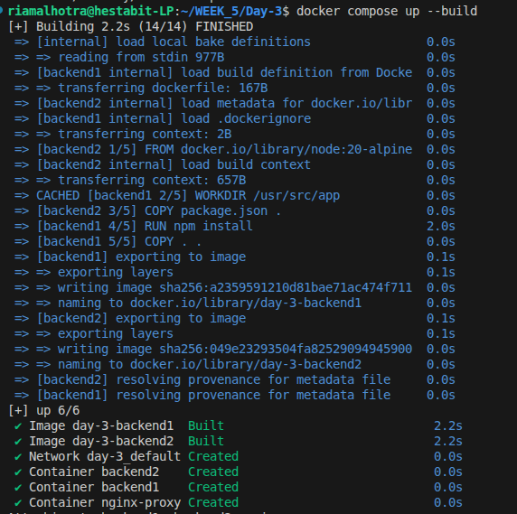
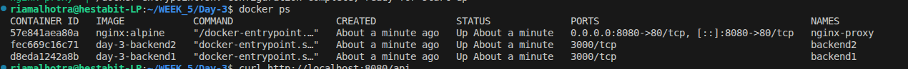
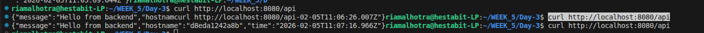

# DAY 3 — NGINX Reverse Proxy & Load Balancing

## Overview
This exercise demonstrates running NGINX inside Docker as a reverse proxy and distributing traffic across multiple backend containers using
round-robin load balancing.

---

## Architecture

Client  
→ NGINX (port 80)  
→ Backend Containers  
- backend1:3000  
- backend2:3000  

---

## Setup Details

### Backend Containers
- Two backend instances are running
- Each backend listens on port 3000
- Each instance returns its own identifier in the response

Screenshot:

---

## Running Containers Verification
The running containers were verified to ensure that both backend instances
and the NGINX proxy container are up and running.

---

## Reverse Proxy & Load Balancing Test
Multiple API requests were sent through the NGINX reverse proxy.  
Each request was forwarded to different backend containers, confirming
round-robin load balancing.

