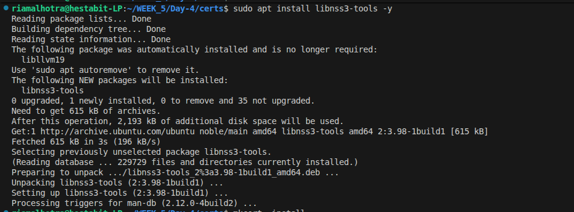
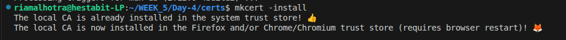
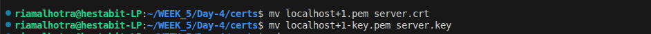
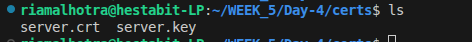
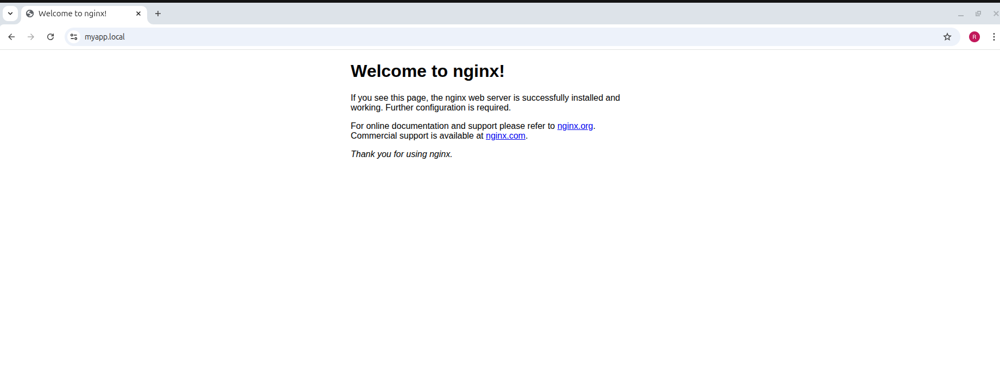
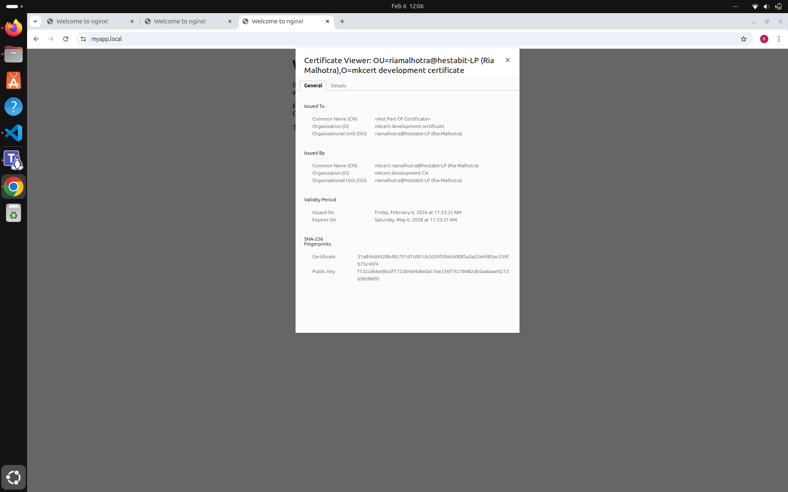

# SSL-SETUP.md
# DAY 4 — SSL + mkcert + HTTPS

## Objective

Enable HTTPS locally using self-signed certificates, configure NGINX for SSL termination, and verify secure access via browser.

## Steps Performed

### 1. Install mkcert

Installed mkcert and required browser trust tools.

**Screenshot:** mkcert --version


### 2. Install Local CA

Installed local certificate authority for browser trust.

**Screenshot:**

sudo apt install libnss3-tools -y



mkcert -install success output




### 3. Generate SSL Certificates

Generated SSL certificates for localhost and myapp.local.

**Screenshot:** certificate generation output 



```bash
ls certs
```




### 4. Map Local Domain

Mapped myapp.local to 127.0.0.1 in hosts file.

```bash
/etc/hosts entry
```

### 5. Configure NGINX for HTTPS

Configured NGINX to:

Serve HTTPS on port 443

Redirect HTTP → HTTPS


### 6. Start NGINX via Docker

Started NGINX container using Docker Compose.

**Screenshot:** docker ps showing running container


 

### 7. Verify HTTPS 

Accessed application securely via browser.

**Screenshot:** https://myapp.local with 🔒 lock icon.




### 8. Verify Redirect via Certificate

Confirmed HTTP redirects to HTTPS.

**Screenshot:** http://myapp.local redirecting to HTTPS




---

## Outcome

HTTPS enabled successfully

Trusted local SSL certificates

HTTP traffic redirected to HTTPS

Secure connection verified

---