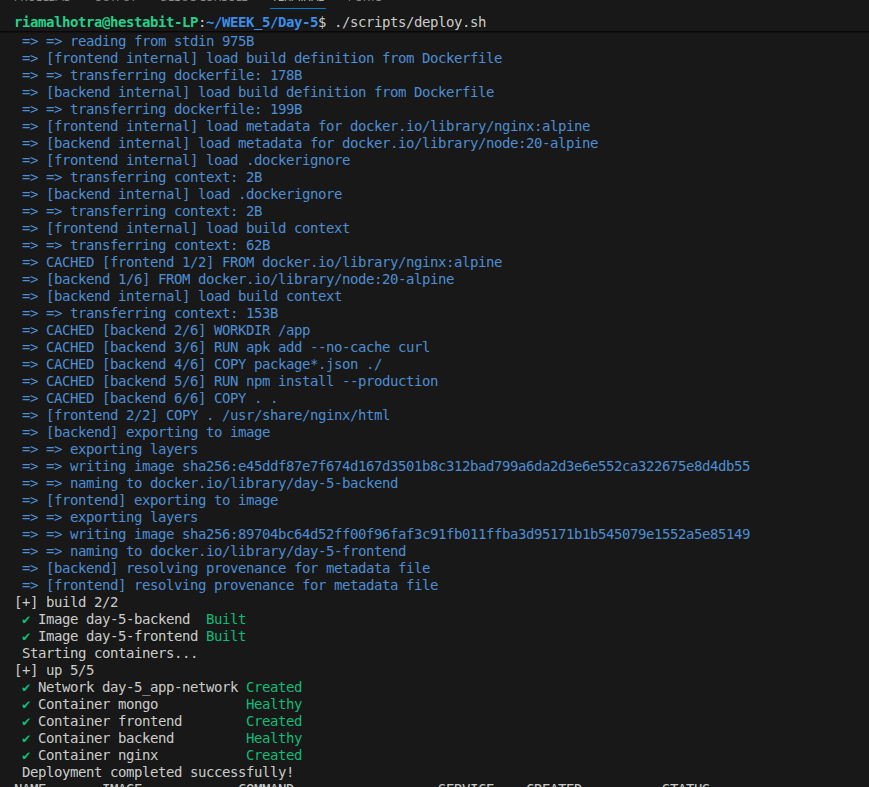
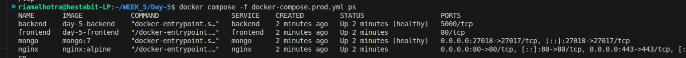
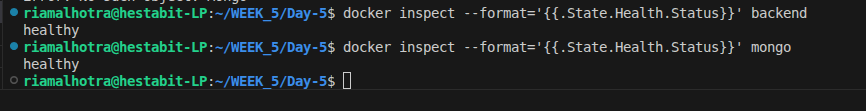
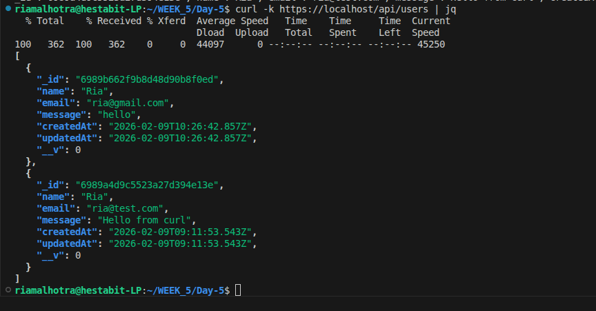
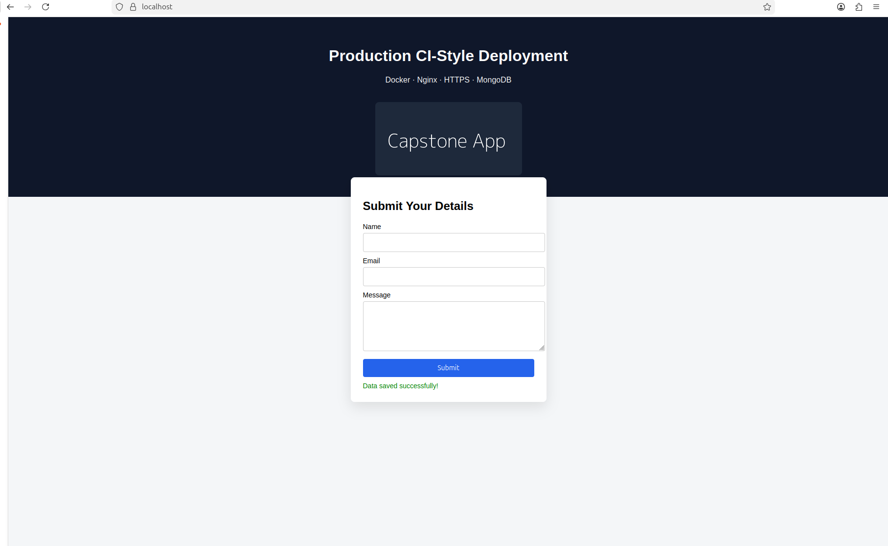

# Production Deployment Report — Day 5
# CI-Style Deployment Automation + Capstone

---

## Overview

This document describes the production deployment of a full-stack application using Docker.
The objective of this exercise was to implement CI-style deployment automation and validate a production-ready setup using health checks, HTTPS, and runtime verification.

---

## Deployment Approach

The application was deployed using a production Docker Compose configuration with the following practices:

* Environment-based configuration using `.env`
* Automated deployment using a shell script
* Backend service health checks
* Restart policies and log rotation
* NGINX reverse proxy with HTTPS

This approach ensures consistency, repeatability, and production readiness.

---

## Deployment Execution

The full application stack was deployed using a single automated command.

Command executed:
./scripts/deploy.sh

Screenshot (deployment script output):

This confirms that the application can be deployed in a CI-style manner using one command.

---

## Running Containers Verification

After deployment, container status was verified to ensure all services were running correctly.

Command executed:
docker ps

Screenshot (running containers):

The output confirms that the backend, frontend, and NGINX containers are running successfully.

---

## Health Check Verification

The backend service includes a Docker health check to verify application readiness.

Command executed:
docker inspect --format='{{.State.Health.Status}}' backend
docker inspect --format='{{.State.Health.Status}}' mongo

Observed output:

This confirms that the backend service is healthy and ready to accept traffic.

---

## API and Reverse Proxy Validation

The backend API was tested through the NGINX reverse proxy over HTTPS.

Command executed:
curl -k https://localhost/api/users |jq

**jq:** jq is a lightweight JSON formatter.

Screenshot (API response):

This confirms correct reverse proxy routing and secure HTTPS communication.

---

## Test browser frontend

The application was accessed using HTTPS to confirm secure communication through the reverse proxy.

1. Open https://localhost in browser

2. Fill the Name, Email, Message form

3. Click Submit

4. Status message: Data saved successfully!

Screenshot:

---

## Verify MongoDB Persistence

Backend logs were inspected to ensure the application started successfully and logging was functioning as expected.

Command executed:
docker logs day-5-backend-1

Screenshot (backend logs):

This confirms application startup and observability through container logs.

---

## Conclusion

This exercise demonstrates a production-ready Docker deployment using CI-style automation, health monitoring, secure communication, and runtime validation, following real-world DevOps best practices.
