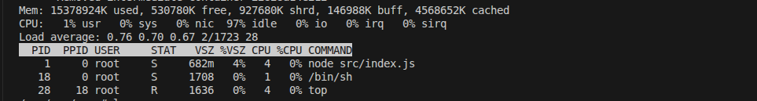
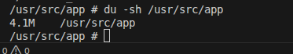

# Linux Inside a Docker Container

**Week 5 – Day 1 | Docker Fundamentals + Linux Internals**

---

## 1. Objective

The objective of this exercise is to understand how a Linux environment works **inside a Docker container** by running a Node.js application, entering the container interactively, and exploring core Linux commands used on production servers.

This simulates how backend applications run and are debugged in real deployment environments.

---

## 2. Environment Details

* Host OS: Ubuntu
* Container Runtime: Docker
* Base Image: `node:20-alpine`
* Application: Node.js API

---

## 3. Docker Image Build

Command used:

```bash
docker build -t node-app .
```

**Screenshot:** 


---

## 4. Running the Container

Command used:

```bash
docker run -d -p 3000:3000 --name week5-container node-app
```

Verify container status:

```bash
docker ps
```

**Screenshot:** 


---

## 5. Entering the Container (Interactive Mode)

The container is accessed similar to SSH using `docker exec`.

Command:

```bash
docker exec -it week5-container /bin/sh
```

---

## 6. Linux Exploration Inside Container

### 6.1 File System Exploration (`ls`)

Command:

```bash
ls
ls -la
```

Purpose:

* View files inside the container
* Verify application files are copied correctly

**Screenshot:** Output of `ls` and `ls -la`


---

### 6.2 Running Processes (`ps`)

Command:

```bash
ps
ps aux
```

Observation:

* The Node.js application runs as the main process (PID 1)
* Containers usually run a single primary process

**Screenshot:** Output of `ps` / `ps aux`


---

### 6.3 System Resource Monitoring (`top`)

Command:

```bash
top
```

Observation:

* Displays CPU and memory usage
* Shows only container-specific processes

**Screenshot:** Output of `top`




---

### 7.4 Disk Usage

Commands:

```bash
df -h
```

Purpose:

* Check filesystem usage
* Understand container disk layers

**Screenshot:** Disk usage output


```bash
du -sh /usr/src/app
```
**screenshot**




---

## 7. Container Logs

Exit the container shell:

```bash
exit
```

View application logs using Docker:

```bash
docker logs week5-container
```

Observation:

* Logs are collected from application stdout
* Docker manages logs externally from the container filesystem

**Screenshot:** Application logs from container


---

## 9. Key Learnings

* Containers are isolated Linux environments
* Containers share the host kernel but not the filesystem
* The application runs as PID 1 inside the container
* Docker captures logs via stdout/stderr
* Debugging containers requires Linux fundamentals

---

## 10. Conclusion

This exercise demonstrates how Docker containers simulate real production servers by running applications inside isolated Linux environments. Understanding Linux commands inside containers is essential for backend development, debugging, and DevOps workflows.

---

